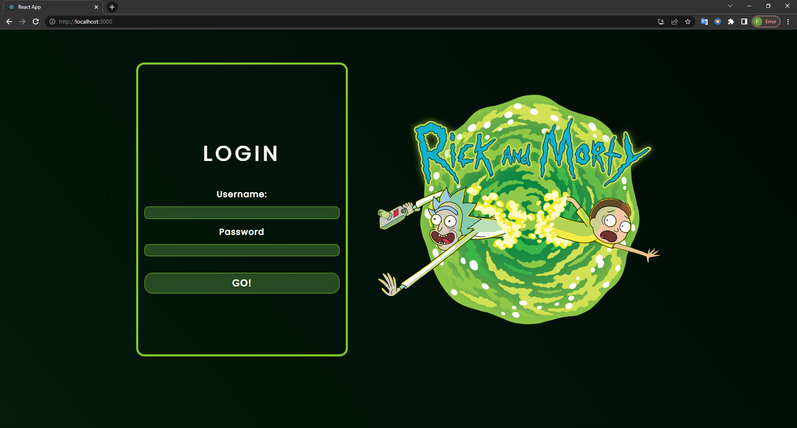
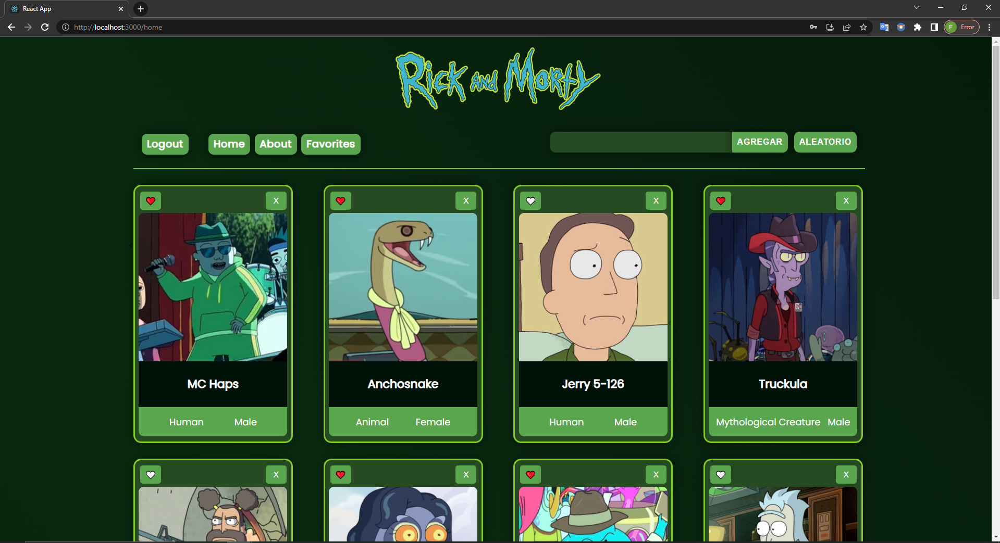
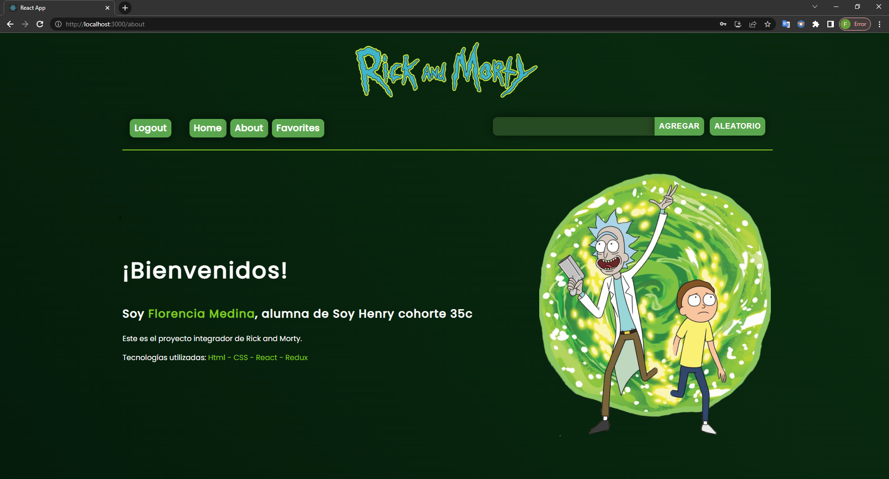

# **RICK AND MORTY** | Proyecto integrador

## **📌 OBJETIVOS**

- Construir una Single Page Application de Rick and Morty 👽.

## **📌 DESCRIPCIÓN DEL PROYECTO**

- En ella se podrá:

✅ Agregar personajes.
<br />
✅ Filtrar y/o ordenar personajes. 
<br />
✅ Ver el detalle de cada personaje.
<br />

## **🦾 TECNOLOGÍAS**

- **JavaScript**, **HTML**, **CSS**, **React**, **Redux**, **Node**, **Express**, **Sequelize**, **PostgreSQL**

## **📍 LANDING PAGE**

**Imágenes**



## **📍 HOME PAGE**

**Imágenes**



## **📍 ABOUT PAGE**



## **⚠️ REQUISITOS PARA INSTALAR LOCALMENTE**

1. Instalar PostgreSQL.
2. Crear una base de datos con el nombre de 'dogs'.
3. Dentro de ./api crear un archivo .env con sus credenciales, como se muestra a continuación:

   ```env
       DB_USER=usuariodepostgres
       DB_PASSWORD=passwordDePostgres
       DB_HOST=localhost
   ```

Reemplazar `usuariodepostgres` y `passwordDePostgres` con tus propias credenciales para conectarte a PostgreSQL.

<br />

**⚠️ INSTALACIÓN**

Utilice el administrador de paquetes npm para instalar. (Recuerde usar este comando dentro de ./client y dentro de ./api):

`npm i`

**⚠️ EJECUCIÓN LOCAL**

- Frontend -> dentro de ./cliente

`npm start`

- Backend -> dentro de ./api

`npm start`

<br />
